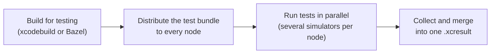

<div align="center">

# 🍷 Mendoza

**Parallel UI testing for iOS and macOS, spread across as many Macs as you have.**

[](https://github.com/Subito-it/Mendoza/releases)


[](LICENSE)


<sub>A session running on 8 concurrent nodes, each driving 2 simulators.</sub>

</div>

Mendoza compiles your UI tests once, ships the test bundle to any number of remote machines, runs a slice of the suite on each of them and hands you back a single `.xcresult`, exactly as if everything had run on one machine. It works just as well on a single Mac, where it runs several simulators side by side.

- ⚡️ **Fast** — tests are dispatched to whichever simulator is free next, longest first when you provide estimates
- 🖥 **Scales out** — add nodes over SSH, with multiple simulators per node on iOS
- 🧱 **Xcode or Bazel** — build with `xcodebuild` or straight from an `ios_ui_test` target
- 🔌 **Pluggable** — customise test discovery, ordering, notifications and teardown with plugins in any language
- 📊 **Rich results** — merged `.xcresult`, JSON and HTML reports, and code coverage
- 🍎 **iOS and macOS** projects

## Contents

- [How it works](#how-it-works)
- [Installation](#installation)
- [Quick start](#quick-start)
- [Commands](#commands)
- [Running tests](#running-tests)
- [Plugins](#plugins)
- [Preparing nodes](#preparing-nodes)
- [Further reading](#further-reading)

## How it works



All of this sits behind a single `test` command, built on the command line tools that ship with Xcode. For the full operation graph and where each plugin hooks in, see [Under the hood](md/under-the-hood.md).

## Installation

Install Mendoza on every node that will run tests:

```sh
brew install Subito-it/made/mendoza
```

> [!NOTE]
> Homebrew warns that `sshpass` was removed for security reasons. Mendoza only needs it if you connect to nodes with a username and password, which is not recommended — prefer SSH keys or the SSH agent. If you do need it, install it with `brew install hudochenkov/sshpass/sshpass` (see the [tap](https://github.com/hudochenkov/homebrew-sshpass)).

### Building from source

```sh
brew install libssh2 openssl@3
git clone https://github.com/Subito-it/Mendoza.git
cd Mendoza
swift build -c release
```

The binary is written to `.build/release/mendoza`. It links dynamically against `libssh2` and `openssl@3`. To link them statically instead, build multi-arch libraries with `./build_libs.rb` and switch to the `Shout-Static` package, which is commented out in `Package.swift`.

## Quick start

### On this Mac

```sh
# iOS
mendoza test --project SomeProject.xcworkspace --scheme SomeScheme \
    --local_destination_path ~/Desktop \
    --device_name "iPhone 16" --device_runtime "18.0"

# macOS
mendoza test --project SomeProject.xcworkspace --scheme SomeScheme \
    --local_destination_path ~/Desktop
```

### Across remote nodes

Describe your nodes once, from inside your project folder:

```sh
mendoza configuration init
```

A few questions later you have a configuration file, which you pass to `test`:

```sh
# iOS
mendoza test --project SomeProject.xcworkspace --scheme SomeScheme \
    --remote_nodes_configuration nodes.json \
    --device_name "iPhone 16" --device_runtime "18.0"

# macOS
mendoza test --project SomeProject.xcworkspace --scheme SomeScheme \
    --remote_nodes_configuration nodes.json
```

Either way Mendoza compiles your project, distributes the test bundle, runs the tests, collects everything on the destination node and writes the [output files](#test-output).

## Commands

| Command | What it does |
| --- | --- |
| [`test`](#running-tests) | Builds and dispatches a test session |
| [`configuration init`](#configuration-init) | Creates a configuration file describing your nodes |
| [`configuration authentication`](#configuration-authentication) | Stores missing node credentials in the local Keychain |
| [`plugin describe`](docs/plugins.md#plugin-describe) | Prints a plugin's input envelope, expected output and a starter script |

### `configuration init`

Walks you through describing your infrastructure and writes the answers to a JSON file. For each node you are asked for:

- a name, used to identify the node in logs
- its address, which must be reachable
- how to authenticate: credentials, SSH keys or the SSH agent
- *iOS only* — how many simulators to run at once. **Autodetect** runs one simulator per two physical CPU cores; **Manual** sets a fixed count, useful on nodes short on RAM. More simulators than the node can sustain still works, but makes the whole session slower.

You also pick the **destination node**, which collects the results of every node, and the path to store them at.

The file describes *where* tests run, not *what* is built: project, scheme and build options are passed to `test` on each invocation, so the same file serves every project you test on those nodes.

### `configuration authentication`

Node credentials are never written to the configuration file: they live in the current user's Keychain, so a configuration generated on another machine comes without them. This command prompts for every node whose authentication is missing and stores the answers locally.

## Running tests

`mendoza test` takes the project to build, where to run and how. These are the options you will reach for most; run `mendoza test --help` for the full list.

| Option | Purpose |
| --- | --- |
| `--project`, `--scheme` | The `.xcworkspace`/`.xcodeproj` and scheme to build |
| `--bazel_target`, `--bazel_config` | Build with Bazel instead, see [Bazel projects](#bazel-projects) |
| `--remote_nodes_configuration` | Configuration file listing the nodes to dispatch to |
| `--local_destination_path` | Run on this Mac only, storing results at this path |
| `--device_name`, `--device_runtime` | Simulator to run on (iOS), e.g. `"iPhone 16"`, `"18.0"` |
| `--device_language`, `--device_locale` | Simulator language and locale, e.g. `en-EN`, `en_US` |
| `--failure_retry` | Number of times a failing test is retried |
| `--include_files`, `--exclude_files` | Wildcards selecting the files tests are extracted from |
| `--exclude_nodes` | Nodes in the configuration to leave out of this session |
| `--build_settings` | Extra build settings for `xcodebuild`, see [below](#additional-build-settings) |
| `--disable_sim_services` | Background services to turn off in each simulator, see [below](#disabling-simulator-services) |
| `--plugins_path`, `--plugin_data` | Where your [plugins](#plugins) live, and a string passed to them |

### Additional build settings

`--build_settings` forwards arbitrary build settings to the `build-for-testing` invocation:

```sh
mendoza test ... --build_settings "SWIFT_COMPILATION_MODE=wholemodule COMPILATION_CACHE_CAS_PATH=/path/to/cas"
```

The string is passed to `xcodebuild` verbatim, so it takes the usual `KEY=value` form.

> [!WARNING]
> Command line build settings **outrank every xcconfig, target and configuration value in your project**, with no way for the project to opt out. Pass only what you intend to override.

Nothing is set by default, so your project's own build configuration is honoured.

### Bazel projects

Mendoza can build an iOS `ios_ui_test` target with Bazel instead of `xcodebuild`. Run it from inside the Bazel workspace and pass the target instead of `--project` and `--scheme`:

```sh
mendoza test --bazel_target=//App:AppUITests --bazel_config=ci ...
```

Mendoza builds the target and its `test_host`, then lays out the products as `xcodebuild build-for-testing` would, so distribution and test execution proceed as for any other project. Pass the same `--bazel_config` values your other builds use to reuse their cache. Requirements, coverage setup and limitations are in [Bazel projects](docs/bazel.md).

### Test diagnostics collection

Mendoza passes `-collect-test-diagnostics never` to `xcodebuild`, overriding your test plan, so sysdiagnoses and log archives are not collected. Crash reports are collected regardless. Opt back in with `--collect_test_diagnostics_on_failure`.

> [!WARNING]
> Diagnostics collection is slow. On every failure, retries included, `xcodebuild` runs `simctl diagnose` with a 600 seconds timeout *after* the verdict is known, keeping the simulator out of rotation for up to 10 minutes and adding several hundred megabytes to the `.xcresult`.

### Disabling simulator services

Each booted iOS simulator runs hundreds of background daemons that consume RAM and CPU even when idle. On memory-constrained nodes, `--disable_sim_services` turns off the ones your tests don't need (iOS 18+):

```sh
mendoza test ... --disable_sim_services siri,intelligence,generative,watch,widgets,posters
```

It accepts group names, such as those above, or individual services. The available groups and the services they contain are listed in [Disabling simulator services](docs/simulator-services.md).

### Test output

Every session writes the following to the destination node:

| File | Contents |
| --- | --- |
| `merged.xcresult` | The result bundle with all test data, ready to open in Xcode |
| `test_details.json` | Detailed insight into the test session |
| `test_result.json` / `.html` | Tests that passed and failed |
| `repeated_test_result.json` / `.html` | Tests that had to be retried |
| `coverage.json` | Coverage summary, from `xcrun llvm-cov export --summary-only` |
| `coverage.html` | Browsable coverage report, from `xcrun llvm-cov show --format=html` |

To dig into why a test failed, open `merged.xcresult` in Xcode, or browse results in a web browser with [Cachi](https://github.com/Subito-it/Cachi).

## Plugins

Plugins customise steps of the pipeline: test discovery, ordering, notifications, pre/post compilation and teardown. A plugin is any executable — Ruby, Python, bash, a compiled binary — that reads one JSON envelope on stdin and writes its result to stdout.

| Plugin | Runs | Returns |
| --- | --- | --- |
| `TestExtractionPlugin` | Instead of scanning the UI test target's files for test methods | The tests to run |
| `TestSortingPlugin` | Before dispatch, to order the tests | The same tests, reordered |
| `EventPlugin` | As the session progresses | Nothing |
| `PreCompilationPlugin` | Before compilation starts | Nothing |
| `PostCompilationPlugin` | After compilation ends, whether or not it succeeded | Nothing |
| `TearDownPlugin` | When the session ends, with its results | Nothing |

The [plugin guide](docs/plugins.md) covers the contract, installation, a complete example and how to debug a plugin by replaying a real invocation.

## Preparing nodes

Mendoza opens many SSH sessions and processes at once. These settings are recommended on every node:

| Setting | How |
| --- | --- |
| SSH `MaxSessions` | Set `MaxSessions 200` in `/etc/ssh/sshd_config` |
| SSH `MaxStartups` | Set `MaxStartups 200:30:300` in `/etc/ssh/sshd_config` |
| Open files | `launchctl limit maxfiles 64000 524288` |
| Processes | `/usr/sbin/sysctl -w kern.maxprocperuid=4096 kern.maxproc=2500` |
| Pseudo terminals | `/usr/sbin/sysctl -w kern.tty.ptmx_max=999` |

Restart sshd after editing its configuration. To see how many sessions Mendoza is using, run `sudo lsof -nPiTCP:22 -sTCP:ESTABLISHED | grep mendoza | wc -l`.

> [!IMPORTANT]
> `MaxStartups` is critical on the destination node. It is commented out by default, which leaves the low default of `10:30:100`. During a run every node opens a fresh SSH connection to the destination for each result transfer, and bursts of completing tests can briefly exceed that limit. When they do, sshd randomly drops connections, silently failing those transfers.

## Further reading

| Document | Covers |
| --- | --- |
| [Plugins](docs/plugins.md) | Writing, installing and debugging plugins |
| [Bazel projects](docs/bazel.md) | Building `ios_ui_test` targets with Bazel |
| [Disabling simulator services](docs/simulator-services.md) | The service catalog behind `--disable_sim_services` |
| [iOS 27 simulator services](docs/ios27-simulator-services.md) | Per-service memory audit of an iOS 27 simulator |
| [Under the hood](md/under-the-hood.md) | The operation graph and how each step works |

## Upgrading to 27.0.0

27.0.0 replaces the plugin system, renames `--plugin_debug` to `--plugin_replay_path` and stops collecting test diagnostics by default. If you are upgrading from an earlier release, read [Migrating to 27.0.0](docs/migrating-to-27.0.0.md).

## Contributing

Contributions are welcome! Report a bug by [opening an issue](https://github.com/Subito-it/Mendoza/issues), or send a pull request.

## Author

[Tomas Camin](https://github.com/tcamin) ([@tomascamin](https://twitter.com/tomascamin))

## License

Mendoza is available under the Apache License, Version 2.0. See the [LICENSE](LICENSE) file for more info.
