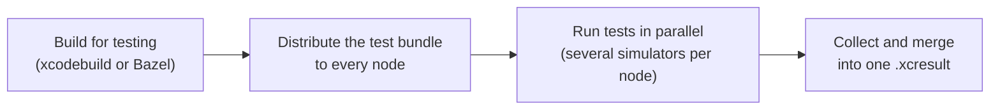

<div align="center">

# 🍷 Mendoza

**Parallel UI testing for iOS and macOS, spread across as many Macs as you have.**

[](https://github.com/Subito-it/Mendoza/releases)


[](LICENSE)


<sub>A session running on 8 concurrent nodes, each driving 2 simulators.</sub>

</div>

Mendoza compiles your UI tests once, ships the test bundle to any number of remote machines, runs a slice of the suite on each of them and hands you back a single `.xcresult`, exactly as if everything had run on one machine. It works just as well on a single Mac, where it runs several simulators side by side.

- ⚡️ **Fast** — tests are dispatched to whichever simulator is free next, longest first when you provide estimates
- 🖥 **Scales out** — add nodes over SSH, with multiple simulators per node on iOS
- 🧱 **Xcode or Bazel** — build with `xcodebuild` or straight from an `ios_ui_test` target
- 🔌 **Pluggable** — customise test discovery, ordering, notifications and teardown with plugins in any language
- 📊 **Rich results** — merged `.xcresult`, JSON and HTML reports, and code coverage
- 🍎 **iOS and macOS** projects

> [!NOTE]
> Upgrading from a release before 27.0.0? Read [Migrating to 27.0.0](#migrating-to-2700) first.

## Contents

- [How it works](#how-it-works)
- [Installation](#installation)
- [Quick start](#quick-start)
- [Commands](#commands)
- [Running tests](#running-tests)
- [Plugins](#plugins)
- [Preparing nodes](#preparing-nodes)
- [Migrating to 27.0.0](#migrating-to-2700)

## How it works



All of this sits behind a single `test` command, built on the command line tools that ship with Xcode. For the full operation graph and where each plugin hooks in, see [Under the hood](md/under-the-hood.md).

## Installation

Install Mendoza on every node that will run tests:

```sh
brew install Subito-it/made/mendoza
```

> [!NOTE]
> Homebrew warns that `sshpass` was removed for security reasons. Mendoza only needs it if you connect to nodes with a username and password, which is not recommended — prefer SSH keys or the SSH agent. If you do need it, install it with `brew install hudochenkov/sshpass/sshpass` (see the [tap](https://github.com/hudochenkov/homebrew-sshpass)).

### Building from source

```sh
brew install libssh2 openssl@3
git clone https://github.com/Subito-it/Mendoza.git
cd Mendoza
swift build -c release
```

The binary is written to `.build/release/mendoza`. It links dynamically against `libssh2` and `openssl@3`. To link them statically instead, build multi-arch libraries with `./build_libs.rb` and switch to the `Shout-Static` package, which is commented out in `Package.swift`.

## Quick start

### On this Mac

```sh
# iOS
mendoza test --project SomeProject.xcworkspace --scheme SomeScheme \
    --local_destination_path ~/Desktop \
    --device_name "iPhone 16" --device_runtime "18.0"

# macOS
mendoza test --project SomeProject.xcworkspace --scheme SomeScheme \
    --local_destination_path ~/Desktop
```

### Across remote nodes

Describe your nodes once, from inside your project folder:

```sh
mendoza configuration init
```

A few questions later you have a configuration file, which you pass to `test`:

```sh
# iOS
mendoza test --project SomeProject.xcworkspace --scheme SomeScheme \
    --remote_nodes_configuration nodes.json \
    --device_name "iPhone 16" --device_runtime "18.0"

# macOS
mendoza test --project SomeProject.xcworkspace --scheme SomeScheme \
    --remote_nodes_configuration nodes.json
```

Either way Mendoza compiles your project, distributes the test bundle, runs the tests, collects everything on the destination node and writes the [output files](#test-output).

## Commands

| Command | What it does |
| --- | --- |
| [`test`](#running-tests) | Builds and dispatches a test session |
| [`configuration init`](#configuration-init) | Creates a configuration file describing your nodes |
| [`configuration authentication`](#configuration-authentication) | Stores missing node credentials in the local Keychain |
| [`plugin describe`](#plugin-describe) | Prints a plugin's input envelope, expected output and a starter script |

### `configuration init`

Walks you through describing your infrastructure and writes the answers to a JSON file. For each node you are asked for:

- a name, used to identify the node in logs
- its address, which must be reachable
- how to authenticate: credentials, SSH keys or the SSH agent
- *iOS only* — how many simulators to run at once. **Autodetect** runs one simulator per two physical CPU cores; **Manual** sets a fixed count, useful on nodes short on RAM. More simulators than the node can sustain still works, but makes the whole session slower.

You also pick the **destination node**, which collects the results of every node, and the path to store them at.

The file describes *where* tests run, not *what* is built: project, scheme and build options are passed to `test` on each invocation, so the same file serves every project you test on those nodes.

### `configuration authentication`

How Mendoza logs into a node — the method, username, password or key paths — is never written to the configuration file. It is stored in the current user's Keychain under the node's name, so a configuration generated on another machine comes without it. This command prompts for every node whose authentication is missing, offering to reuse the previous node's, and stores the answers locally.

### `plugin describe`

Prints the JSON envelope a plugin receives on stdin and the output it is expected to write on stdout, together with a minimal starter script. The sample is generated from Mendoza's own types, so it always matches the version you are running.

```sh
mendoza plugin describe TearDownPlugin
```

## Running tests

`mendoza test` takes the project to build, where to run and how. These are the options you will reach for most; run `mendoza test --help` for the full list.

| Option | Purpose |
| --- | --- |
| `--project`, `--scheme` | The `.xcworkspace`/`.xcodeproj` and scheme to build |
| `--bazel_target`, `--bazel_config` | Build with Bazel instead, see [Bazel projects](#bazel-projects) |
| `--remote_nodes_configuration` | Configuration file listing the nodes to dispatch to |
| `--local_destination_path` | Run on this Mac only, storing results at this path |
| `--device_name`, `--device_runtime` | Simulator to run on (iOS), e.g. `"iPhone 16"`, `"18.0"` |
| `--device_language`, `--device_locale` | Simulator language and locale, e.g. `en-EN`, `en_US` |
| `--failure_retry` | Number of times a failing test is retried |
| `--include_files`, `--exclude_files` | Wildcards selecting the files tests are extracted from |
| `--exclude_nodes` | Nodes in the configuration to leave out of this session |
| `--build_settings` | Extra build settings for `xcodebuild`, see [below](#additional-build-settings) |
| `--disable_sim_services` | Background services to turn off in each simulator, see [below](#disabling-simulator-services) |
| `--plugins_path`, `--plugin_data` | Where your [plugins](#plugins) live, and a string passed to them |

### Additional build settings

`--build_settings` forwards arbitrary build settings to the `build-for-testing` invocation:

```sh
mendoza test ... --build_settings "SWIFT_COMPILATION_MODE=wholemodule COMPILATION_CACHE_CAS_PATH=/path/to/cas"
```

The string is passed to `xcodebuild` verbatim, so it takes the usual `KEY=value` form.

> [!WARNING]
> Command line build settings **outrank every xcconfig, target and configuration value in your project**, with no way for the project to opt out. Pass only what you intend to override.

Nothing is set by default, so your project's own build configuration is honoured.

### Bazel projects

Mendoza can build an iOS `ios_ui_test` target with Bazel instead of `xcodebuild`. Run it from inside the Bazel workspace and pass the target instead of `--project` and `--scheme`:

```sh
mendoza test --bazel_target=//App:AppUITests --bazel_config=ci ...
```

Mendoza runs `bazel build` on the target and its `test_host`, then lays out the products as `xcodebuild build-for-testing` would: the app, a UI test runner built from the platform's `XCTRunner.app` and an `.xctestrun`. Distribution and test execution then proceed as for any other project.

`--bazel_config` takes a comma separated list of configs, each passed as `--config`. Pass the configs your other builds use: Bazel only reuses cached outputs of builds with identical flags, and every flag change makes it discard its analysis cache. The test target, its test host and its sources are read with `bazel query` and `bazel cquery` using the same configs, so these queries reuse the build's analysis.

- The test target must have a `test_host` and exactly one `swift_library` dependency, whose sources Mendoza scans for tests.
- Code coverage is collected only if the configs instrument the app (`--collect_code_coverage`, `--experimental_use_llvm_covmap`, and an `--instrumentation_filter` matching the app's targets). Mendoza checks the built app and fails when it is not instrumented and `--individual_test_coverage` or `--test_covered_files` were passed, warning otherwise. Bazel records source paths relative to the workspace, so coverage reports are the same whichever machine built the outputs.
- The products are downloaded even if a config uses `--remote_download_minimal`, since Mendoza copies them out of Bazel's output tree. Bundles built as archives (without `--define=apple.experimental.tree_artifact_outputs=1`) are extracted.
- The `env` and `args` attributes of the test target are not applied. Use `--device_language` and `--device_locale` to set up the simulators.
- `--build_configuration` and `--build_settings` only apply to `xcodebuild` and are rejected. `--clear_derived_data_on_failure` is ignored, as Bazel keeps its build state in its output base.

### Test diagnostics collection

By default Mendoza passes `-collect-test-diagnostics never` to `xcodebuild`, which disables the collection of verbose diagnostics (sysdiagnoses, log archives). It always passes the parameter explicitly, since `xcodebuild` would otherwise fall back to the value in your test plan.

You can opt back in with `--collect_test_diagnostics_on_failure`.

> [!WARNING]
> Diagnostics collection has a **significant performance impact on test dispatching**. When a test fails, `xcodebuild` invokes `simctl diagnose` with a 600 seconds timeout, gathering several hundred megabytes of data into the `.xcresult`. This happens *after* the test verdict has been reported, and the simulator is kept out of rotation for the entire collection: a single failure can idle a simulator for up to 10 minutes, and with retries enabled the cost is paid on every attempt.

Crash reports are collected by Mendoza independently of this setting.

### Disabling simulator services

On iOS, each booted simulator runs hundreds of background daemons that consume RAM and CPU even when idle. On memory-constrained nodes running multiple simulators this pressure can destabilize tests. `--disable_sim_services` disables unnecessary daemons via `launchctl disable`, freeing resources for actual test execution.

```sh
mendoza test ... --disable_sim_services siri,intelligence,generative,watch,widgets,posters
```

Tokens are resolved from a catalog of known-safe services. You can pass **group names**, which expand to all underlying services, or **individual service IDs**:

| Group | Feature | Services |
|-------|---------|----------|
| `payments` | StoreKit / in-app purchase | storekitd, itunesstored, amsaccountsd, amsengagementd, amsondevicestoraged, passd, financed |
| `app-store` | App Store | appstored, itunesstored |
| `spotlight` | Spotlight & Settings search | searchd, searchtoold |
| `siri` | Siri & speech | assistantd, corespeechd, siriinferenced, siriknowledged, siriactionsd, sirittsd, siricontextd, siriacousticsignatured |
| `photos` | Photos library & analysis | assetsd, photoanalysisd |
| `widgets` | Widgets & Live Activities | chronod, liveactivitiesd |
| `intelligence` | Apple Intelligence | intelligenceplatformd, intelligencetasksd, intelligenceflowd, intelligencecontextd, callintelligenced, fitnessintelligenced |
| `posters` | Lock screen & wallpaper posters | posterboard, postersyncd |
| `generative` | Generative AI & ML models | generativeexperiencesd, imageplaygroundd, modelcatalogd, modelmanagerd, textunderstandingd, hybridsearchd, voicebankingd, translationd, mlhostd, mlruntimed, knowledgeconstructiond, agentstored, contentlinkingd, naturallanguaged |
| `watch` | Apple Watch companion | nanoregistrylaunchd, nanomapscd, nanosystemsettingsd, npkcompanionagent, companionappd, brookcompaniond, appconduitd, nanoappregistryd, nanonewscd, pairedsyncd, pairedunlockd, companiond, companionmessagesd, companionfindlocallyd |

Individual services can also be passed directly (e.g. `--disable_sim_services weatherd,newsd,gamed`).

The override persists across reboots on iOS 18+. Mendoza tracks which labels it manages, so it re-enables any previously disabled service that is no longer in the desired set.

> [!TIP]
> Some services are only kept alive by another one that enables them, and disabling those on their own does not hold. The Watch companion family is the known case: every daemon in the simulator's `/System/Library/NanoLaunchDaemons` ships disabled in its own plist and runs only because `nanoregistrylaunchd` enables the whole directory on demand, well after boot. Disabling `nanoregistrylaunchd` is what keeps the family down, which is why it leads the `watch` group. If you pass the individual Watch services without it, Mendoza warns that they were re-enabled after the reboot and every subsequent run pays an extra simulator reboot.

For a full audit of per-service memory usage on iOS 27, see [docs/ios27-simulator-services.md](docs/ios27-simulator-services.md).

### Test output

Every session writes the following to the destination node:

| File | Contents |
| --- | --- |
| `merged.xcresult` | The result bundle with all test data, ready to open in Xcode |
| `test_details.json` | Detailed insight into the test session |
| `test_result.json` / `.html` | Tests that passed and failed |
| `repeated_test_result.json` / `.html` | Tests that had to be retried |
| `coverage.json` | Coverage summary, from `xcrun llvm-cov export --summary-only` |
| `coverage.html` | Browsable coverage report, from `xcrun llvm-cov show --format=html` |

To dig into why a test failed, open `merged.xcresult` in Xcode, or browse results in a web browser with [Cachi](https://github.com/Subito-it/Cachi).

## Plugins

Plugins customise steps of Mendoza's pipeline to fit your own workflow.

A plugin is **any executable file** — Ruby, Python, bash, a compiled binary, anything with a shebang. Mendoza writes a single JSON envelope to its **stdin** and reads the result from its **stdout**, so nodes need nothing installed beyond whatever your plugin itself requires.

| Plugin | Runs | Returns |
| --- | --- | --- |
| `TestExtractionPlugin` | Instead of scanning the UI test target's files for test methods | The tests to run |
| `TestSortingPlugin` | Before dispatch, to order the tests | The same tests, reordered |
| `EventPlugin` | As the session progresses | Nothing |
| `PreCompilationPlugin` | Before compilation starts | Nothing |
| `PostCompilationPlugin` | After compilation ends, whether or not it succeeded | Nothing |
| `TearDownPlugin` | When the session ends, with its results | Nothing |

### The contract

| Channel | Carries |
| --- | --- |
| **stdin** | one JSON envelope (below) |
| **stdout** | the result as JSON, or nothing for plugins that return no value |
| **stderr** | your logs and diagnostics, captured into the session's HTML log |
| **exit code** | `0` on success. Anything else fails the session, with stderr attached to the error — except for `EventPlugin`, whose failures are [deliberately ignored](#debugging-plugins) |

The envelope always carries the same two keys:

```json
{
  "input": { },
  "data": "…"
}
```

- `input` is the plugin's typed input. It is `{}` for plugins that take none.
- `data` is the `--plugin_data` string, passed verbatim and never parsed by Mendoza. It is `null` when unset.

Run `mendoza plugin describe <name>` to see the exact envelope and expected output for a given plugin.

### Installing a plugin

Three things must be true for a plugin to run:

1. the file is named **exactly** after the plugin type, with **no extension**, e.g. `TearDownPlugin`
2. it lives in the folder passed as `--plugins_path` (defaulting to the folder containing your configuration file)
3. it is executable — `chmod +x`. Mendoza will not set the bit for you

Get the first two wrong and the plugin is simply not found, which Mendoza treats differently depending on whether it needed a value from it:

- `TestExtractionPlugin` and `TestSortingPlugin` **fail the session**, since Mendoza cannot substitute a result for the one it asked for
- the other four are **skipped silently**, and the pipeline runs as if you had never installed one

A file that is found but not executable always fails the session, with the `chmod +x` to run. That asymmetry is deliberate: a misnamed file is indistinguishable from a plugin you chose not to install, while a missing executable bit is unambiguously a mistake.

### A complete plugin

```ruby
#!/usr/bin/env ruby
require "json"

# Mendoza always writes the envelope to stdin. Accepting a file path as well costs one line
# and makes the plugin runnable under a debugger — see below.
payload = JSON.parse(ARGV[0] ? File.read(ARGV[0]) : $stdin.read)
input   = payload["input"]
data    = JSON.parse(payload["data"] || "{}")

warn "considering #{input["candidates"].size} files"   # diagnostics go to stderr

tests = decide_tests(input, data)

# stdout is the result, decoded by Mendoza as [TestCase]
puts JSON.generate(tests.map { |t| { "name" => t.name, "suite" => t.suite } })
```

> [!IMPORTANT]
> Never `print`/`puts` anything but the result: stdout **is** the result.

### TestExtractionPlugin

By default, test methods are extracted from every file in the UI testing target. That covers most projects, but not ones with custom rules about what runs where, for example tests tagged to run only on iPhone or only on iPad. This plugin replaces the default extraction with your own.

See the example [TestExtractionPlugin](md/TestExtractionPlugin_example.rb).

### TestSortingPlugin

Without this plugin tests are dispatched in the order they were discovered, because Mendoza knows nothing about how long each one takes. Returning them from longest to shortest lets the slow tests start first, so the session doesn't end waiting on a single long test, and can cut total execution time significantly.

The plugin must return exactly the tests it was given: a result that adds or drops any fails the session rather than silently changing what runs. Tools like [Cachi](https://github.com/Subito-it/Cachi) can store and serve the test statistics to sort by.

See the example [TestSortingPlugin](md/TestSortingPlugin_example.rb).

### EventPlugin

Invoked at each milestone of the session, with `kind` set to one of `start`, `startCompiling`, `stopCompiling`, `startTesting`, `stopTesting`, `stop` and `error`. Use it to send notifications or update a dashboard.

### PreCompilationPlugin and PostCompilationPlugin

Run on the compiling node around the build, for projects that need changes made before compilation, such as patching an Info.plist. The post compilation plugin runs whether or not compilation succeeded, so it is the place to undo whatever the pre compilation plugin changed.

### TearDownPlugin

Runs once the session ends and receives its results, so it can act on the outcome: publish a report, notify on failures, upload artifacts.

### Debugging plugins

Because a plugin's entire input is one JSON document on stdin, you can replay a real invocation offline instead of running a test session for every change.

**Every** invocation writes its envelope to `<PluginName>.<timestamp>.json`, with no flag required. That is deliberate: you usually discover you want the input *after* the run that misbehaved, and a `TearDownPlugin` envelope — that session's specific pass/fail/retry set — cannot be reconstructed on demand. When a plugin fails, the error tells you how to replay it:

```
🔌 TearDownPlugin failed with status code 1
undefined method `dig' for nil:NilClass (teardown_notify.rb:42)
To reproduce: cat '/tmp/mendoza/logs/TearDownPlugin.20260820-154512.482.json' | '/path/to/plugins/TearDownPlugin'
```

By default envelopes land in the session logs folder, which is **wiped when the next session starts**. Pass `--plugin_replay_path` to keep them somewhere durable — a folder your CI can archive, or one you can point a debugger at:

```sh
mendoza test … --plugin_replay_path ./mendoza-replay
```

So the loop is:

```sh
# 1. keep a real envelope as a fixture
cp ./mendoza-replay/TearDownPlugin.20260820-154512.482.json fixtures/teardown.json

# 2. iterate in a second, without Mendoza
cat fixtures/teardown.json | ./TearDownPlugin
```

One file is written per invocation, timestamped to the millisecond, so a plugin invoked repeatedly during a session — like `EventPlugin` — leaves one envelope per event rather than overwriting itself.

For the plugins that return a value, check the shape of what you print as well as the values, since a result Mendoza cannot decode fails the session:

```sh
cat fixtures/extraction.json | ./TestExtractionPlugin | jq -e 'all(has("name") and has("suite"))'
```

Anything your plugin writes to stderr is captured in the session logs at `/tmp/mendoza/logs/localhost-Plugin-<PluginName>.html`, even when the plugin succeeds. `EventPlugin` failures are intentionally ignored so that a broken notification cannot fail a test run — for that plugin the HTML log is the only place its diagnostics appear.

> [!CAUTION]
> The envelope contains your `--plugin_data` verbatim, so if that carries tokens or webhook URLs the dump does too. It is written `0600`, but **strip `data` before committing an envelope as a fixture**.

#### Running a plugin under a debugger

Editors launch a program directly rather than through a shell, so a run configuration cannot redirect a file into stdin. Read the envelope from an argument when one is given, and the problem disappears:

```ruby
payload = JSON.parse(ARGV[0] ? File.read(ARGV[0]) : $stdin.read)
```

```python
payload = json.load(open(sys.argv[1]) if len(sys.argv) > 1 else sys.stdin)
```

Mendoza always passes the envelope on stdin and never as an argument, so this costs nothing in production and keeps the payload out of `argv`, where it would be subject to the size limit that stdin exists to avoid. With that line in place, debugging is whatever your language already does — point your run configuration at the plugin and pass the fixture path as its argument:

```json
// .vscode/launch.json
{
  "type": "rdbg",
  "request": "launch",
  "script": "${workspaceFolder}/plugins/TearDownPlugin",
  "args": ["${workspaceFolder}/fixtures/teardown.json"]
}
```

Breakpoints, stepping and variable inspection then work as usual, with no pipes involved.

Saved envelopes also make plugins unit-testable: commit one as a fixture and assert your plugin's output in your own CI, with no Mendoza involved.

## Preparing nodes

Mendoza opens many SSH sessions and processes at once. These settings are recommended on every node:

| Setting | How |
| --- | --- |
| SSH `MaxSessions` | Set `MaxSessions 200` in `/etc/ssh/sshd_config` |
| SSH `MaxStartups` | Set `MaxStartups 200:30:300` in `/etc/ssh/sshd_config` |
| Open files | `launchctl limit maxfiles 64000 524288` |
| Processes | `/usr/sbin/sysctl -w kern.maxprocperuid=4096 kern.maxproc=2500` |
| Pseudo terminals | `/usr/sbin/sysctl -w kern.tty.ptmx_max=999` |

Restart sshd after editing its configuration. To see how many sessions Mendoza is using, run `sudo lsof -nPiTCP:22 -sTCP:ESTABLISHED | grep mendoza | wc -l`.

> [!IMPORTANT]
> `MaxStartups` is critical on the destination node. It is commented out by default, which leaves the low default of `10:30:100`. During a run every node opens a fresh SSH connection to the destination for each result transfer, and bursts of completing tests can briefly exceed that limit. When they do, sshd randomly drops connections, silently failing those transfers.

## Migrating to 27.0.0

27.0.0 replaces the plugin system and changes two things about how `test` is invoked. If you don't use plugins, only [Test diagnostics](#test-diagnostics-are-no-longer-collected-by-default) affects you.

### Plugins are now executables, not Swift scripts

Previously a plugin was a `.swift` file containing a struct with a `handle()` method. Mendoza appended a runner to it, compiled it with `#!/usr/bin/swift`, and passed the input as two positional arguments. Now a plugin is **any executable in any language**: Mendoza writes one JSON envelope to its stdin and reads the result from its stdout.

| | Before | Now |
| --- | --- | --- |
| File name | `TearDownPlugin.swift` | `TearDownPlugin` (no extension) |
| Language | Swift only | anything with a shebang, or a compiled binary |
| Executable bit | set by Mendoza | **you** must `chmod +x` |
| Input | two `argv` entries: input JSON, then plugins data | one JSON envelope on stdin: `{"input": …, "data": …}` |
| Output | stdout after a `# plugin-result` marker | the whole of stdout |
| Diagnostics | mixed into stdout | stderr, captured into the session log |
| Dependencies | [swift sh](https://github.com/mxcl/swift-sh) | whatever your language already uses |

To port an existing plugin:

1. rename the file to drop `.swift`, and `chmod +x` it
2. read the envelope from stdin instead of `argv`, taking `input` and `data` from it
3. print only the result to stdout, and move any logging to stderr

Run `mendoza plugin describe <PluginName>` to print the exact envelope your plugin will receive along with a starter script. The output is generated from Mendoza's own types, so it always matches the version you are running. See [Plugins](#plugins) for the full contract.

Because the two systems share no surface, a plugin that has not been ported is not silently ignored: `TestExtractionPlugin` and `TestSortingPlugin` fail the session, and the remaining plugins are skipped.

#### `EventPlugin`: `kind` is now a string

`Event.Kind` was encoded as an integer, so its values depended on declaration order. It is now the case name:

```diff
- {"kind": 2, "info": {}}
+ {"kind": "startCompiling", "info": {}}
```

If you were switching on `0`, `1`, `2`… switch on `"start"`, `"stop"`, `"startCompiling"`, `"stopCompiling"`, `"startTesting"`, `"stopTesting"` and `"error"` instead.

`TearDownPlugin`'s input is unchanged, including `status` as `0` for passed and `1` for failed.

#### `plugin init` is gone

Plugin templates were generated by `plugin init`. Use [`plugin describe`](#plugin-describe) instead, which prints the envelope and a starter script for a given plugin without writing anything to disk.

### `--plugin_debug` is now `--plugin_replay_path`

`--plugin_debug` took no value and kept Mendoza's intermediate files next to your plugins. It has been removed, so a command line still passing it now fails to parse.

Every invocation now dumps its stdin envelope as `<PluginName>.<timestamp>.json` with no flag required, so replaying a failure is always possible after the fact. `--plugin_replay_path <path>` only chooses **where**, the default being the session logs folder, which is wiped when the next session starts:

```diff
- mendoza test … --plugin_debug
+ mendoza test … --plugin_replay_path ./mendoza-replay
```

See [Debugging plugins](#debugging-plugins) for the replay loop.

### Test diagnostics are no longer collected by default

Mendoza now always passes `-collect-test-diagnostics never` to `xcodebuild`, where previously it passed nothing and `xcodebuild` fell back to the value in your test plan. If your test plan enabled diagnostics and you rely on the sysdiagnoses and log archives in the `.xcresult`, pass `--collect_test_diagnostics_on_failure` to restore the old behaviour — and read [Test diagnostics collection](#test-diagnostics-collection) first, because it is slow enough to matter. Crash reports are collected either way.

## Contributing

Contributions are welcome! Report a bug by [opening an issue](https://github.com/Subito-it/Mendoza/issues), or send a pull request.

## Author

[Tomas Camin](https://github.com/tcamin) ([@tomascamin](https://twitter.com/tomascamin))

## License

Mendoza is available under the Apache License, Version 2.0. See the [LICENSE](LICENSE) file for more info.
