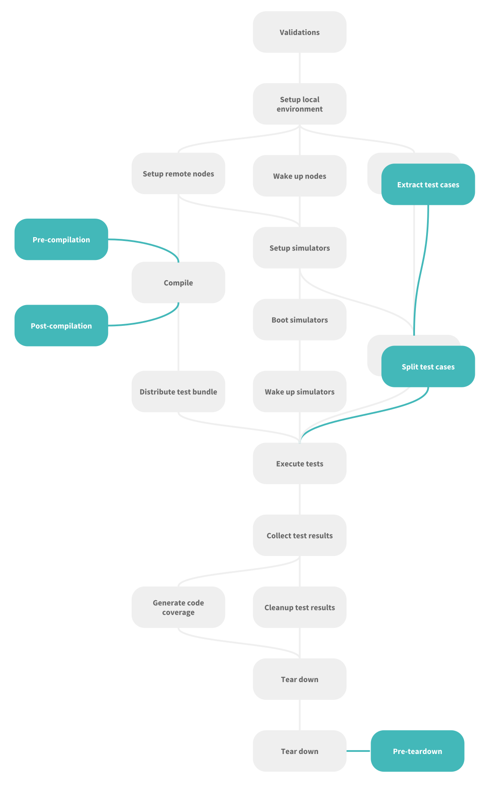

# 🔬 Under the hood

The architecture of Mendoza is based on a set of NSOperations orchestrated by a single NSOperationQueue. The chart below shows operation's dependencies and external plugins support.

## Operations

### validationOperation

Validate configuration file checking for missing credentials, passwords, network reachability and dependencies.

### macValidationOperation (macOS projects only)

For macOS projects we validate that the all testing nodes are running the same OS version.

### localSetupOperation

Prepares filesystem on the compiling node.

### setupOperation

Prepares filesystem on the remote testing nodes. Initializes RAM disks if necessary.

### wakeupOperation

A workaround tasks that applies to Macbook with closed lids.

### testExtractionOperation

Extract test methods from UI test target files. Can be overridden by plugin implementation.

### compileOperation

Compile project using xcodebuild's `build-for-testing` which will produce a test bundle that will be later sent to remote nodes. Pre/post compilation can be customize with plugins. 

### testDistributionOperation

Distributes test methods over available nodes. Can be overridden by plugin implementation to achieve a more balanced total execution time per node.

### simulatorSetupOperation (iOS projects only)

Prepares simulators on testing nodes by installing missing runtimes or simulator devices.

### simulatorBootOperation (iOS projects only)

Simulators are booted to allow tests to start as soon as compilation ends

### simulatorWakeupOperation (iOS projects only)

Open simulator.app to avoid using headless simulators.

### distributeTestBundleOperation

The test bundle generated by the compilation operation is sent over to remote nodes.

### testRunnerOperation

Tests are executed using xcodebuild's `test-without-building` passing the tests to be executed on each node vias `only-testing` parameter.

### testCollectorOperation

Collects the results sending them to the destination node.

### testTearDownOperation

Write test result summary files (json, html)

### cleanupOperation

Reclaim disk space by removing unneeded files

### simulatorsTearDownOperation  (iOS projects only)

Reset simulators cleanup.

### tearDownOperation

Reset filesystem cleanup. Can be extended by the TearDown plugin
