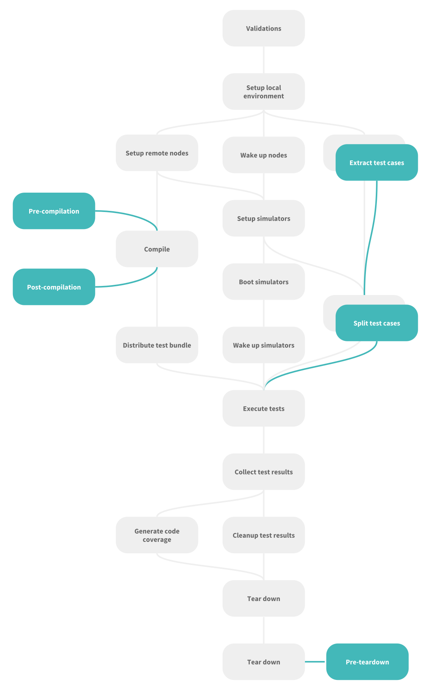

# 🔬 Under the hood

The architecture of Mendoza is based on a set of NSOperations orchestrated by a single NSOperationQueue. The chart below shows operation's dependencies and external plugins support.

## Operations

### initialSetupOperation

Initial setup checking that all nodes are ready to properly execute tests

### validationOperation

Validate configuration file checking for missing credentials, passwords, network reachability and dependencies.

### macValidationOperation (macOS projects only)

For macOS projects we validate that the all testing nodes are running the same OS version.

### localSetupOperation

Prepares filesystem on the compiling node.

### remoteSetupOperation

Prepares filesystem on the remote testing nodes.

### testExtractionOperation

Extract test methods from UI test target files. Can be overridden by plugin implementation.

### compileOperation

Compile project using xcodebuild's `build-for-testing` which will produce a test bundle that will be later sent to remote nodes. Pre/post compilation can be customize with plugins. 

### testSortingOperation

Returning a sorted list of tests from longest to shortest execution time will optimize total execution time of your test suite

### simulatorSetupOperation (iOS projects only)

Prepares simulators on testing nodes by installing missing runtimes or simulator devices.

### processKillerOperation (iOS projects only, optional)

Kills leftover simulator-related processes on testing nodes before tests run. Only added to the pipeline when enabled in the configuration.

### distributeTestBundleOperation

The test bundle generated by the compilation operation is sent over to remote nodes.

### testRunnerOperation

Tests are executed using xcodebuild's `test-without-building` passing the tests to be executed on each node vias `only-testing` parameter.

### testCollectorOperation

Collects the results sending them to the destination node.

### codeCoverageCollectionOperation

Merges the collected `.profdata` files and generates the final coverage reports (JSON, HTML).

### simulatorTearDownOperation (iOS projects only)

Reset simulators cleanup.

### cleanupOperation

Reclaim disk space by removing unneeded files

### tearDownOperation

Write test result summary files (json, html) and reset filesystem cleanup. Can be extended by the TearDown plugin.
